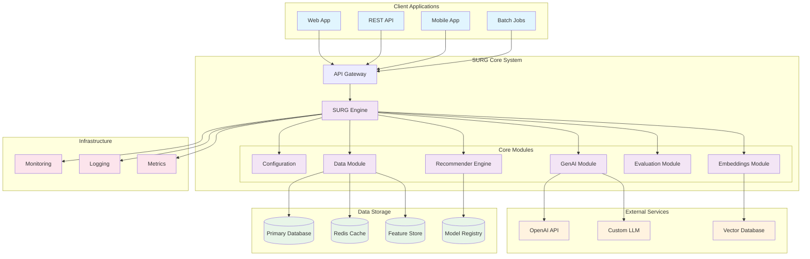
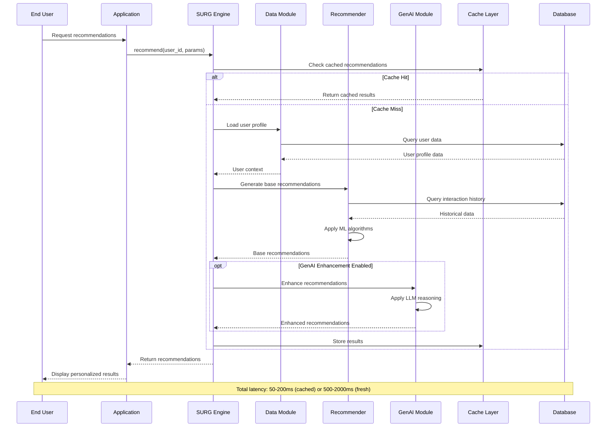
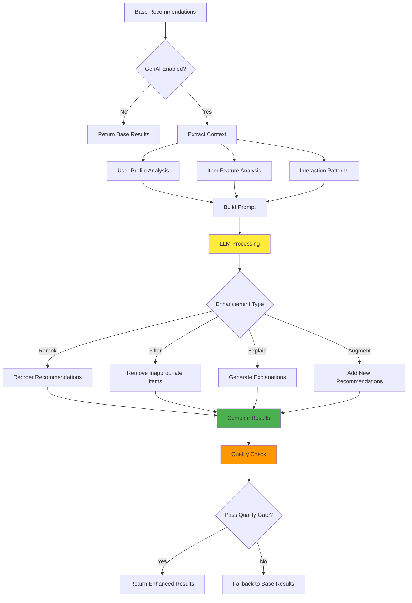
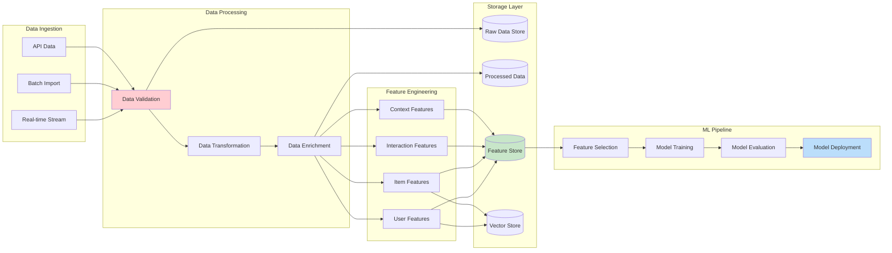
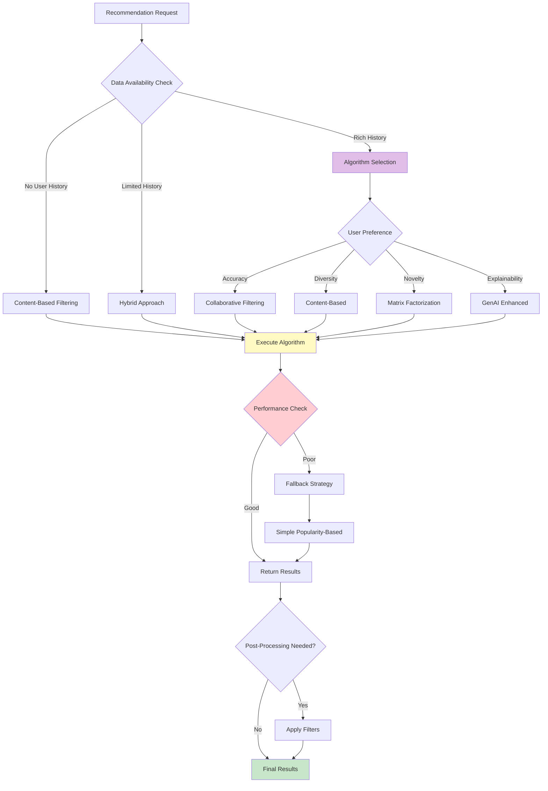
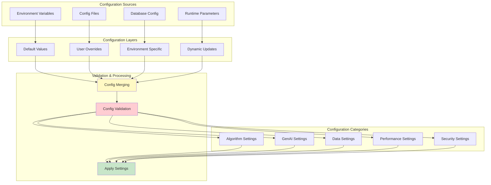
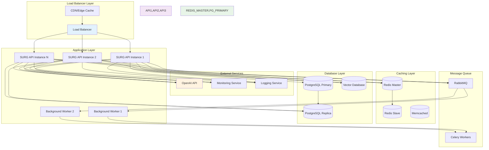
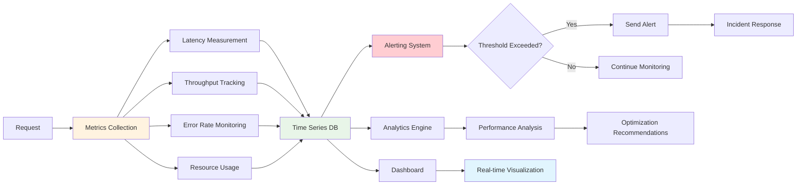
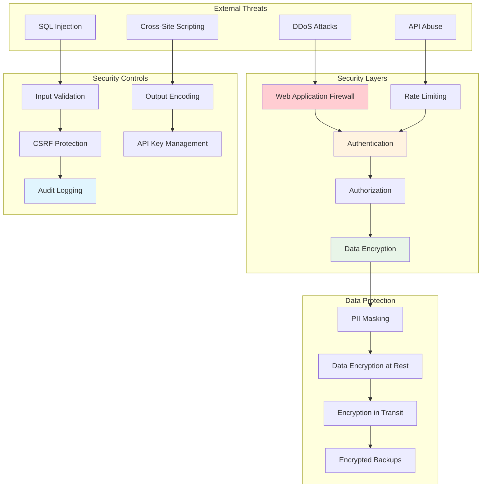

# SURG Architecture Documentation

This document provides detailed architectural diagrams and explanations for the SURG (Smart User Recommendation with GenAI) system.

## 🏗️ High-Level System Architecture

## 🔄 Recommendation Generation Flow

## 🧠 GenAI Enhancement Pipeline

## 📊 Data Flow Architecture

## 🎯 Algorithm Selection Flow

## 🔧 Configuration Management

## 🚀 Deployment Architecture

## 📈 Performance Monitoring Flow

## 🔒 Security Architecture

This comprehensive architecture documentation provides multiple perspectives on the SURG system, from high-level overviews to detailed implementation flows. Each diagram serves a specific purpose in understanding different aspects of the system's design and operation.