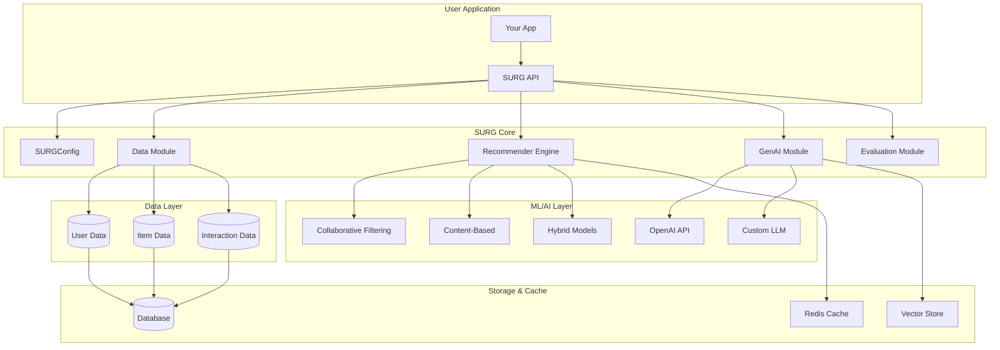
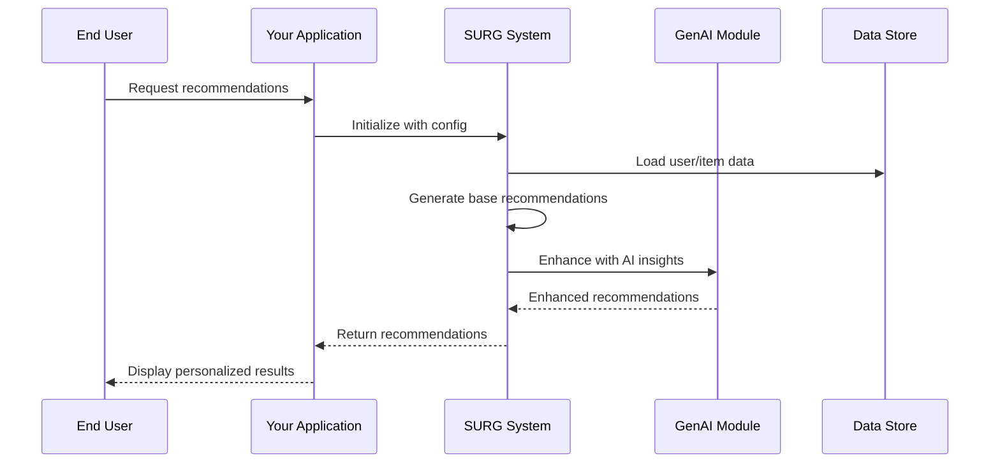
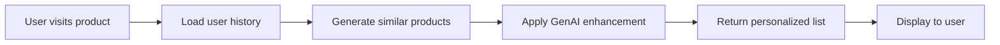
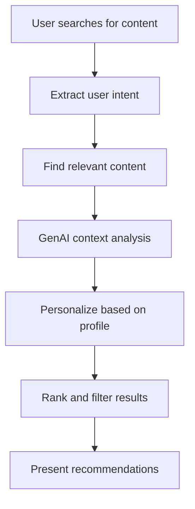

# SURG Examples & Documentation

This directory contains comprehensive examples, tutorials, and architectural documentation for the SURG (Smart User Recommendation with GenAI) system.

## 🏗️ System Architecture



## 🚀 Quick Start Flow



## 📚 Available Examples

### 🔰 Basic Usage
- [`basic_recommendation.py`](./basic/basic_recommendation.py) - Simple recommendation pipeline
- [`data_preparation.py`](./basic/data_preparation.py) - Data loading and preprocessing
- [`quick_start.py`](./basic/quick_start.py) - 5-minute getting started guide

### 🧠 GenAI Integration
- [`genai_enhanced_recommendations.py`](./advanced/genai_enhanced_recommendations.py) - AI-powered recommendation enhancement
- [`custom_prompts.py`](./advanced/custom_prompts.py) - Custom prompt engineering
- [`multi_modal_recommendations.py`](./advanced/multi_modal_recommendations.py) - Text, image, and context-aware recommendations

### 🏭 Production Examples
- [`production_deployment.py`](./production/production_deployment.py) - Production-ready deployment
- [`scalable_architecture.py`](./production/scalable_architecture.py) - Horizontal scaling patterns
- [`monitoring_logging.py`](./production/monitoring_logging.py) - Comprehensive monitoring

### 🎯 Domain-Specific Examples
- [`ecommerce_recommendations.py`](./domains/ecommerce_recommendations.py) - E-commerce product recommendations
- [`content_recommendations.py`](./domains/content_recommendations.py) - Content/article recommendations
- [`movie_recommendations.py`](./domains/movie_recommendations.py) - Entertainment recommendations

### 📊 Evaluation & Testing
- [`evaluation_metrics.py`](./evaluation/evaluation_metrics.py) - Model evaluation and metrics
- [`ab_testing.py`](./evaluation/ab_testing.py) - A/B testing framework
- [`performance_benchmarks.py`](./evaluation/performance_benchmarks.py) - Performance testing

## 🎯 User Journey Examples

### 1. Simple E-commerce Recommendation



### 2. Content Discovery with AI



## 🛠️ Installation & Setup

### Option 1: Basic Installation
```bash
pip install surg
```

### Option 2: Full Installation (Recommended)
```bash
pip install surg[all]
```

### Option 3: Development Installation
```bash
git clone https://github.com/shivam-pandey-15/surg.git
cd surg
pip install -e .[dev]
```

## ⚡ Quick Start (30 seconds)

```python
from surg import SURG, SURGConfig

# Initialize with OpenAI
config = SURGConfig(
    genai_provider="openai",
    openai_api_key="your-api-key"
)
surg = SURG(config)

# Load your data
surg.load_data(
    users_df=users_df,
    items_df=items_df,
    interactions_df=interactions_df
)

# Get recommendations
recommendations = surg.recommend(
    user_id="user123",
    num_recommendations=10,
    enhance_with_genai=True
)
```

## 📖 Detailed Examples

Each example includes:
- ✅ Complete, runnable code
- 📝 Step-by-step explanations
- 🎯 Real-world use cases
- 🔧 Configuration options
- 📊 Performance considerations
- 🐛 Common troubleshooting

## 🎮 Interactive Demos

Run interactive Jupyter notebooks:
```bash
jupyter lab examples/notebooks/
```

Available notebooks:
- `01_getting_started.ipynb` - Interactive tutorial
- `02_advanced_features.ipynb` - Deep dive into features
- `03_production_setup.ipynb` - Production deployment guide

## 📊 Sample Data

We provide sample datasets for testing:

```bash
# Generate sample e-commerce data
python examples/data/generate_ecommerce_data.py

# Generate sample content data
python examples/data/generate_content_data.py

# Generate sample movie data
python examples/data/generate_movie_data.py
```

## 🔧 Configuration Examples

### Environment Variables
```bash
# Copy example environment file
cp examples/.env.example .env

# Edit with your settings
OPENAI_API_KEY=your-openai-key
SURG_LOG_LEVEL=INFO
SURG_CACHE_ENABLED=true
```

### Configuration File
```python
# config.yaml
genai:
  provider: "openai"
  model: "gpt-3.5-turbo"
  temperature: 0.7

database:
  host: "localhost"
  port: 5432
  name: "surg_db"

cache:
  enabled: true
  ttl: 3600
```

## 🚀 Next Steps

1. **Start with basics**: Run `examples/basic/quick_start.py`
2. **Explore your domain**: Check domain-specific examples
3. **Integrate GenAI**: Try AI-enhanced recommendations
4. **Scale up**: Review production examples
5. **Contribute**: Submit your own examples!

## 📞 Support

- 📖 [Full Documentation](../docs/)
- 🐛 [Report Issues](https://github.com/shivam-pandey-15/surg/issues)
- 💬 [Community Discussions](https://github.com/shivam-pandey-15/surg/discussions)
- 📧 [Email Support](mailto:shivampandey15199@gmail.com)