# SURG User Journey & Flow Documentation

This document provides detailed user journey flows and practical usage patterns for the SURG (Smart User Recommendation with GenAI) system.

## 🚀 Getting Started Flow

```mermaid
flowchart TD
    A[Install SURG] --> B{Choose Installation Type}
    B -->|Basic| C[pip install surg]
    B -->|Full Features| D[pip install surg[all]]
    B -->|Development| E[pip install surg[dev]]
    
    C --> F[Basic Setup Complete]
    D --> G[Full Setup Complete]
    E --> H[Dev Setup Complete]
    
    F --> I[Run Quick Start Example]
    G --> I
    H --> I
    
    I --> J{Works Correctly?}
    J -->|Yes| K[Proceed to Integration]
    J -->|No| L[Check Troubleshooting Guide]
    
    L --> M[Fix Issues]
    M --> I
    
    K --> N[Choose Your Use Case]
    N --> O[E-commerce]
    N --> P[Content Recommendation]
    N --> Q[Custom Domain]
    
    style A fill:#e1f5fe
    style K fill:#c8e6c9
    style N fill:#fff3e0
```

## 🔧 Integration Patterns

### Pattern 1: Simple Integration (5 minutes)

```python
# Minimal setup for basic recommendations
from surg import SURG, SURGConfig

# 1. Configure
config = SURGConfig()
surg = SURG(config)

# 2. Load data
surg.load_data(users_df, items_df, interactions_df)

# 3. Get recommendations
recommendations = surg.recommend(user_id="user123", num_recommendations=10)
```

### Pattern 2: Production Integration (30 minutes)

```python
# Production-ready setup with caching and monitoring
from surg import SURG, SURGConfig
from surg.cache import RedisCache
from surg.monitoring import MetricsCollector

# 1. Configure with production settings
config = SURGConfig(
    algorithm="hybrid",
    cache_enabled=True,
    monitoring_enabled=True,
    genai_provider="openai",
    openai_api_key=os.getenv('OPENAI_API_KEY')
)

# 2. Initialize with cache and monitoring
cache = RedisCache(url="redis://localhost:6379")
metrics = MetricsCollector()
surg = SURG(config, cache=cache, metrics=metrics)

# 3. Load data from database
surg.load_data_from_database(connection_string="postgresql://...")

# 4. Get enhanced recommendations
recommendations = surg.recommend(
    user_id="user123",
    num_recommendations=10,
    enhance_with_genai=True,
    context={"session": "browsing", "device": "mobile"}
)
```

## 📊 Data Preparation Flow

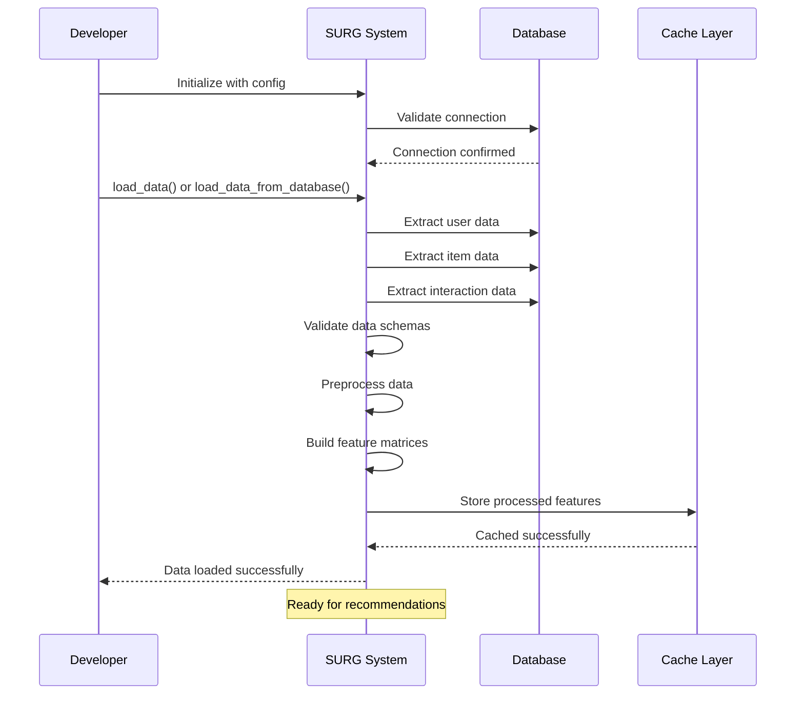

## 🎯 Recommendation Generation Patterns

### 1. Basic Recommendations

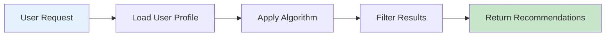

**Code Example:**
```python
# Basic recommendation flow
recommendations = surg.recommend(
    user_id="user123",
    num_recommendations=10,
    exclude_seen=True
)
```

### 2. Context-Aware Recommendations

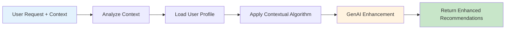

**Code Example:**
```python
# Context-aware recommendations
recommendations = surg.recommend(
    user_id="user123",
    num_recommendations=10,
    context={
        "time_of_day": "evening",
        "device": "mobile",
        "location": "home",
        "mood": "relaxed"
    },
    enhance_with_genai=True
)
```

### 3. Batch Processing Pattern

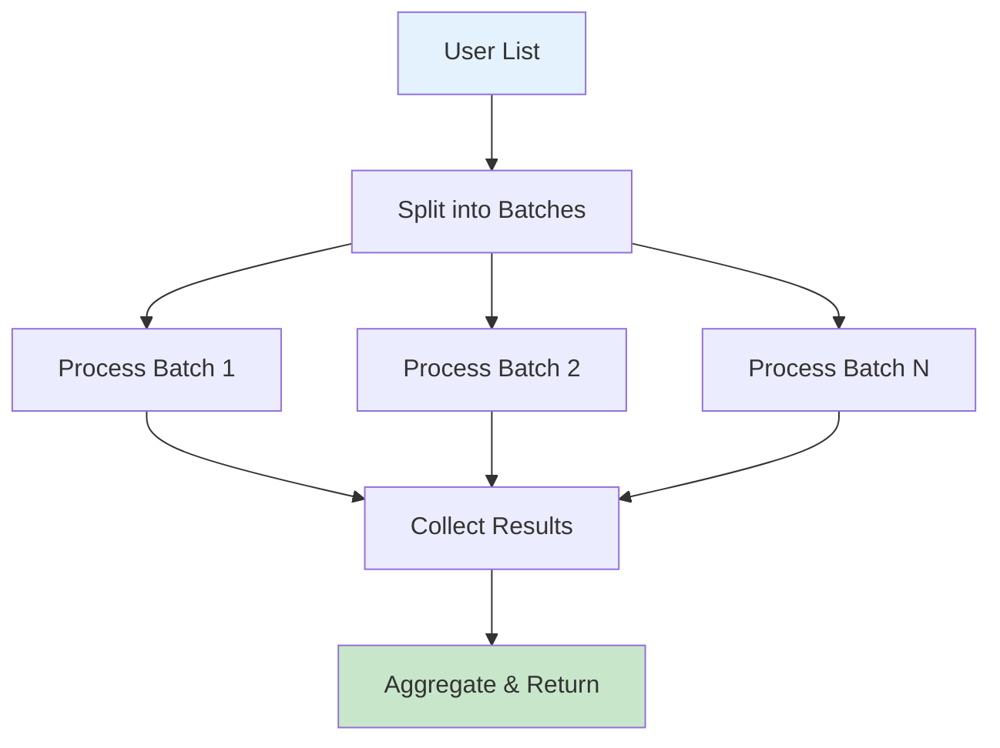

**Code Example:**
```python
# Batch recommendations for multiple users
user_ids = ["user1", "user2", "user3", ...]
batch_results = surg.recommend_batch(
    user_ids=user_ids,
    num_recommendations=5,
    max_concurrent=10
)
```

## 🔄 Real-time vs Batch Processing

### Real-time Pattern (< 200ms response)

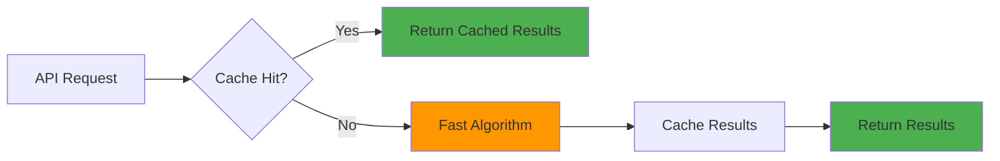

**Use Cases:**
- Web page recommendations
- Mobile app suggestions
- Real-time personalization

**Configuration:**
```python
config = SURGConfig(
    algorithm="collaborative_filtering",  # Fast algorithm
    cache_enabled=True,
    cache_ttl=3600,  # 1 hour
    timeout=0.2  # 200ms max
)
```

### Batch Pattern (High accuracy, longer processing)

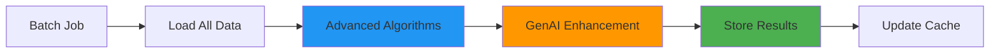

**Use Cases:**
- Email recommendations
- Weekly digest generation
- Offline model training

**Configuration:**
```python
config = SURGConfig(
    algorithm="hybrid",
    genai_provider="openai",
    batch_size=1000,
    enable_deep_analysis=True
)
```

## 🎨 GenAI Enhancement Workflows

### Workflow 1: Explanation Generation

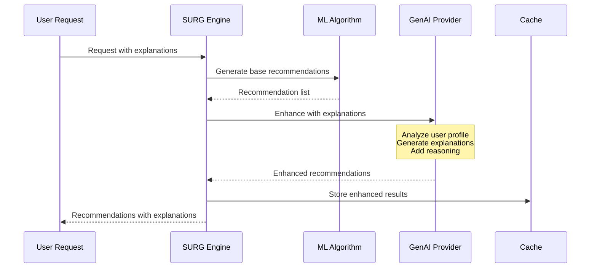

### Workflow 2: Contextual Adaptation

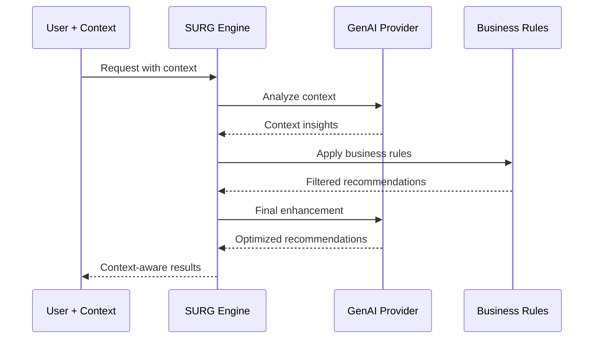

## 📱 Platform-Specific Integration Patterns

### Web Application Integration

```javascript
// Frontend JavaScript integration
class SURGClient {
    constructor(apiUrl, apiKey) {
        this.apiUrl = apiUrl;
        this.apiKey = apiKey;
    }
    
    async getRecommendations(userId, options = {}) {
        const response = await fetch(`${this.apiUrl}/recommend`, {
            method: 'POST',
            headers: {
                'Authorization': `Bearer ${this.apiKey}`,
                'Content-Type': 'application/json'
            },
            body: JSON.stringify({
                user_id: userId,
                num_recommendations: options.count || 10,
                context: this.getPageContext(),
                ...options
            })
        });
        
        return await response.json();
    }
    
    getPageContext() {
        return {
            page_type: window.location.pathname.split('/')[1],
            device_type: this.detectDevice(),
            time_of_day: this.getTimeOfDay()
        };
    }
}
```

### Mobile App Integration

```swift
// iOS Swift integration
class SURGRecommendationService {
    private let apiUrl: String
    private let apiKey: String
    
    init(apiUrl: String, apiKey: String) {
        self.apiUrl = apiUrl
        self.apiKey = apiKey
    }
    
    func getRecommendations(
        userId: String,
        count: Int = 10,
        context: [String: Any] = [:],
        completion: @escaping (Result<[Recommendation], Error>) -> Void
    ) {
        let requestBody: [String: Any] = [
            "user_id": userId,
            "num_recommendations": count,
            "context": mergeContext(context),
            "enhance_with_genai": true
        ]
        
        // Make API request...
    }
    
    private func mergeContext(_ userContext: [String: Any]) -> [String: Any] {
        var context = userContext
        context["device_type"] = "mobile"
        context["app_version"] = Bundle.main.appVersion
        context["location"] = getCurrentLocation()
        return context
    }
}
```

## 🔧 Configuration Patterns

### Development Configuration

```python
# Development setup for testing and experimentation
config = SURGConfig(
    environment="development",
    algorithm="hybrid",
    debug=True,
    log_level="DEBUG",
    
    # Use sample data
    use_sample_data=True,
    sample_data_size=1000,
    
    # Enable all features for testing
    genai_provider="openai",
    enable_explanations=True,
    enable_context_analysis=True,
    
    # Fast iteration
    cache_enabled=False,  # Always fresh results
    timeout=10.0  # Longer timeout for debugging
)
```

### Production Configuration

```python
# Production-optimized configuration
config = SURGConfig(
    environment="production",
    algorithm="hybrid",
    debug=False,
    log_level="INFO",
    
    # Performance optimization
    cache_enabled=True,
    cache_ttl=3600,
    max_concurrent_requests=100,
    
    # Reliability
    circuit_breaker_enabled=True,
    retry_count=3,
    timeout=5.0,
    
    # Monitoring
    metrics_enabled=True,
    health_checks_enabled=True,
    
    # GenAI settings
    genai_provider="openai",
    genai_timeout=10.0,
    genai_fallback_enabled=True
)
```

## 📊 Monitoring & Analytics Patterns

### Performance Monitoring Flow

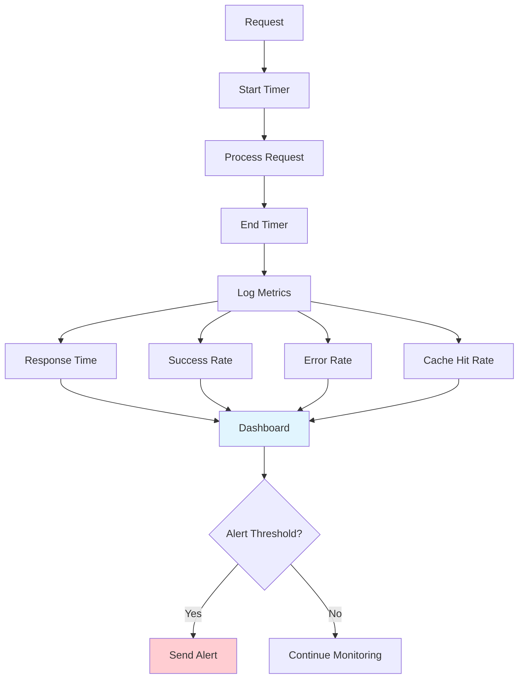

### A/B Testing Pattern

```python
# A/B testing different algorithms
from surg.testing import ABTest

# Define test variants
variants = {
    'control': SURGConfig(algorithm="collaborative_filtering"),
    'treatment': SURGConfig(algorithm="hybrid", genai_provider="openai")
}

# Create A/B test
ab_test = ABTest(
    name="algorithm_comparison",
    variants=variants,
    traffic_split=0.1,  # 10% of traffic
    success_metric="click_through_rate"
)

# Use in recommendation flow
variant = ab_test.get_variant(user_id)
config = variants[variant]
surg = SURG(config)
recommendations = surg.recommend(user_id, num_recommendations=10)

# Track results
ab_test.track_event(user_id, "recommendation_shown", {
    "variant": variant,
    "recommendations": len(recommendations)
})
```

## 🚀 Deployment Patterns

### Cloud Deployment Flow

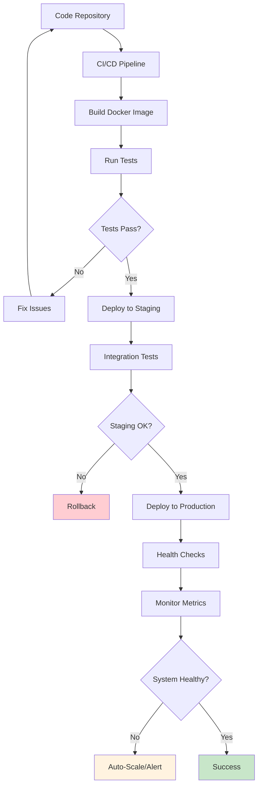

### Kubernetes Deployment

```yaml
# kubernetes/deployment.yaml
apiVersion: apps/v1
kind: Deployment
metadata:
  name: surg-api
spec:
  replicas: 3
  selector:
    matchLabels:
      app: surg-api
  template:
    metadata:
      labels:
        app: surg-api
    spec:
      containers:
      - name: surg-api
        image: surg:latest
        ports:
        - containerPort: 8000
        env:
        - name: OPENAI_API_KEY
          valueFrom:
            secretKeyRef:
              name: surg-secrets
              key: openai-api-key
        resources:
          requests:
            memory: "512Mi"
            cpu: "200m"
          limits:
            memory: "1Gi"
            cpu: "500m"
        livenessProbe:
          httpGet:
            path: /health
            port: 8000
          initialDelaySeconds: 30
          periodSeconds: 10
```

## 🔍 Troubleshooting Common Flows

### Issue: Slow Recommendations

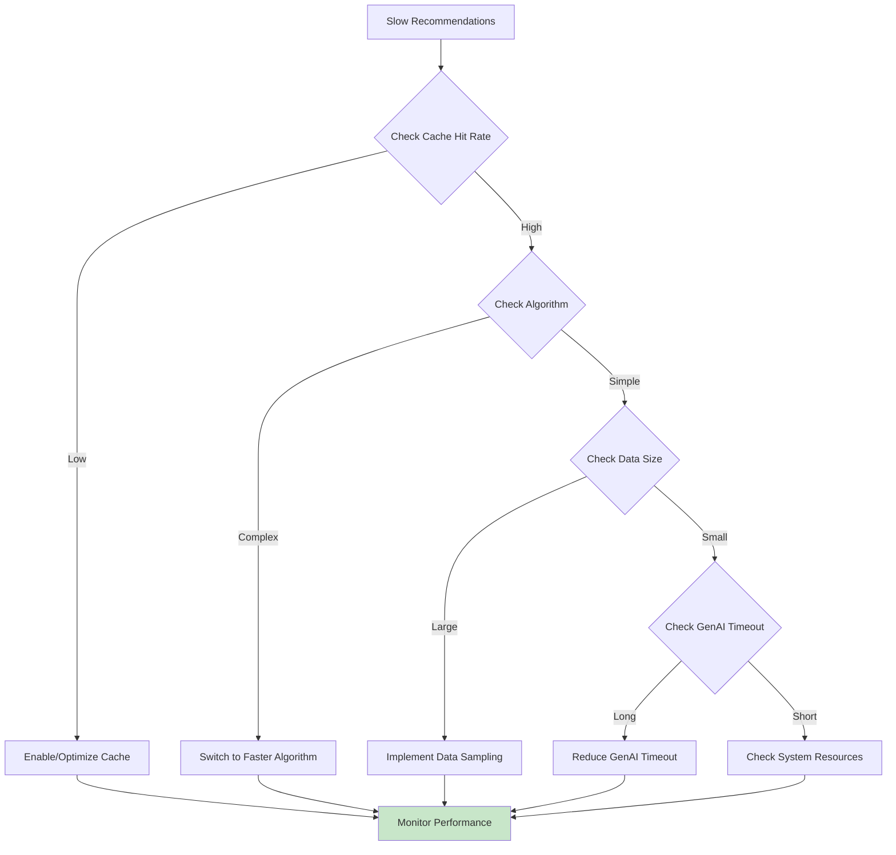

### Issue: Poor Recommendation Quality

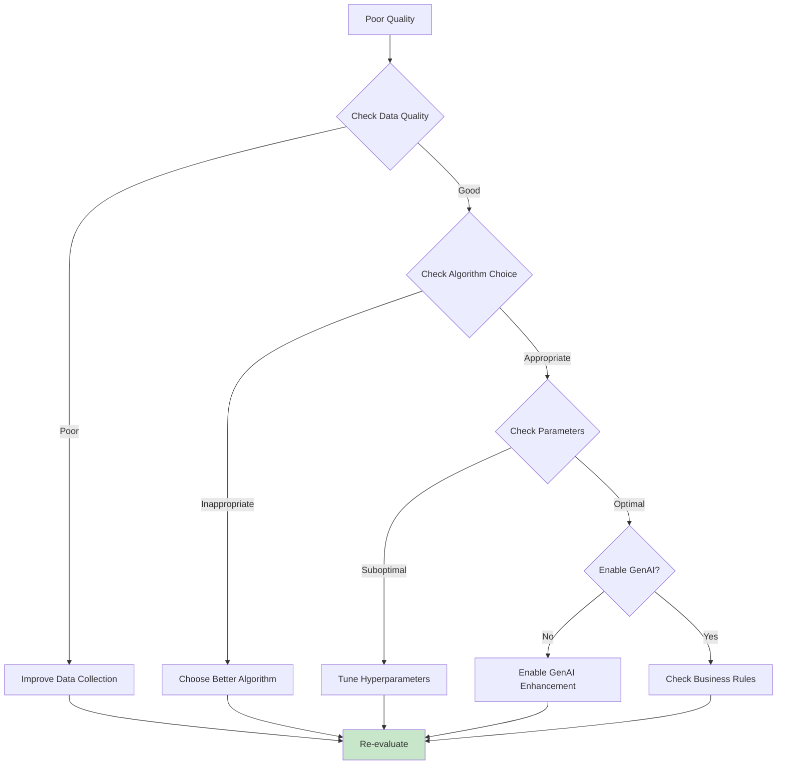

This comprehensive flow documentation provides practical guidance for implementing SURG in various scenarios, from simple integrations to complex production deployments.